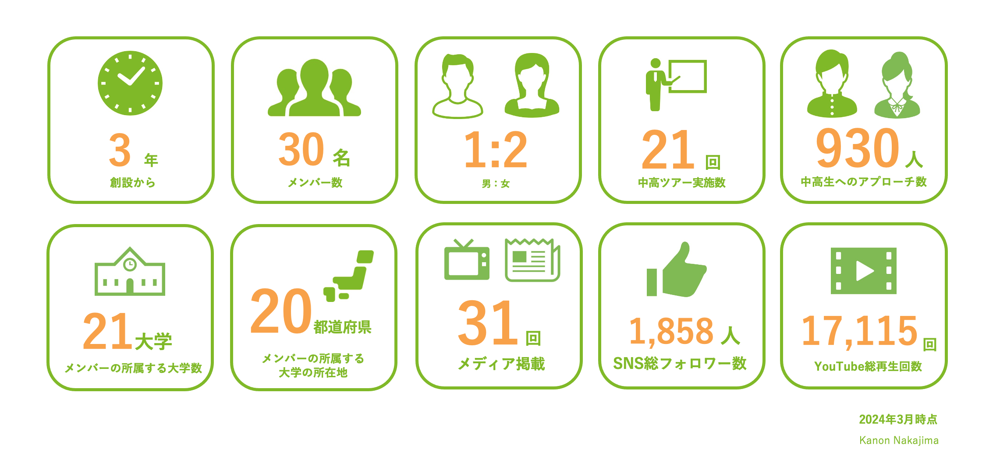

## Vcan とは？

Vcan は医学生を中心に全国で活動する学生団体。
現役産婦人科医にアドバイザーとしてついていただき、HPV ワクチンの医学的に正しい情報を発信しています。

定期接種を逃し、キャッチアップ接種を受けた当事者として、専門家と市民の間のギャップを埋め、当事者自身が HPV ワクチンを自分ごととして接種するかどうか判断できる社会を創ります。

単に知識がなかっただけで、子宮頸がんをはじめ予防できたはずの病気で苦しむ人を増やしたくない。

## Vcan の活動指針

## 代表の言葉

みなさまはじめまして、Vcan にて代表を務めております大坪琉奈です。

HPV ワクチンの接種については様々な意見があるかと思います。 同じ接種しないでも、自分で決めて接種しなかったのと、何も知らずに接種できなかったのは大きく異なります。接種するのも、接種しないのも、個人の選択であることは間違いありません。ただ、正しい知識を得られないまま、考える機会すら逃し自分の意見を持てない現状がとても悔しいです。

私は、人の笑顔を増やしたくて、沢山の方の人生に関わることのできる医師になることを決めました。個々人に深く関わることのできる医師になるまで、まだまだ道のりは長いです。 学生のうちにできることとして、少し歳上のお兄さんお姉さんの立場から、中高生や同級生世代に医学的に正しい情報を届けることに決めました。

「知らないまま後悔しないで」 このキャッチコピーは何にでも通じるものだと思います。 社会は大人が動かすだけではない。私たちも社会を変えられる。

もちろん楽ではない活動ですが、かけがえのないメンバーと出会えて、すてきなご縁を運んできてきてくれる Vcan が大好きです。 いつも応援してくださる皆さま、ありがとうございます。

新たに Vcan を見つけて下さった大学生！ご協力いただける教育関係者の方、医師の方、行政の方！その他共感してくださる団体の方！ いつでもご連絡お待ちしております。
